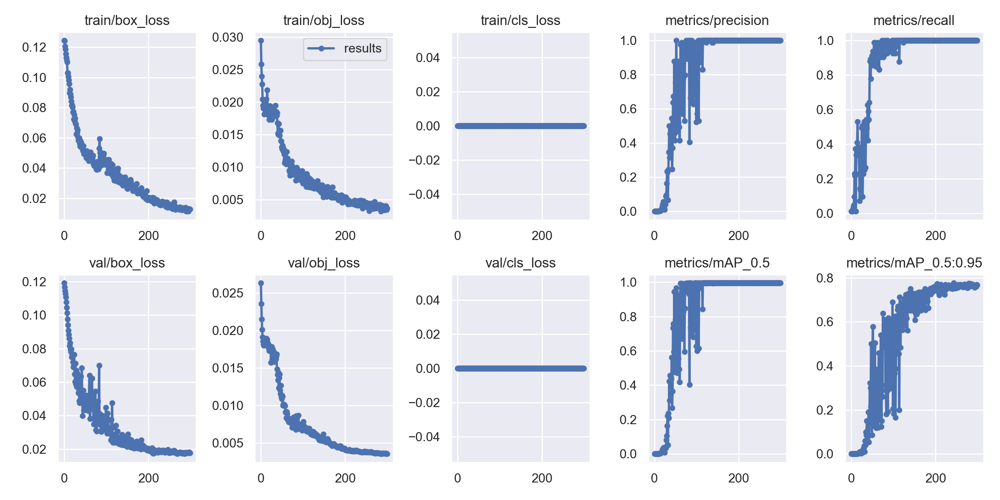
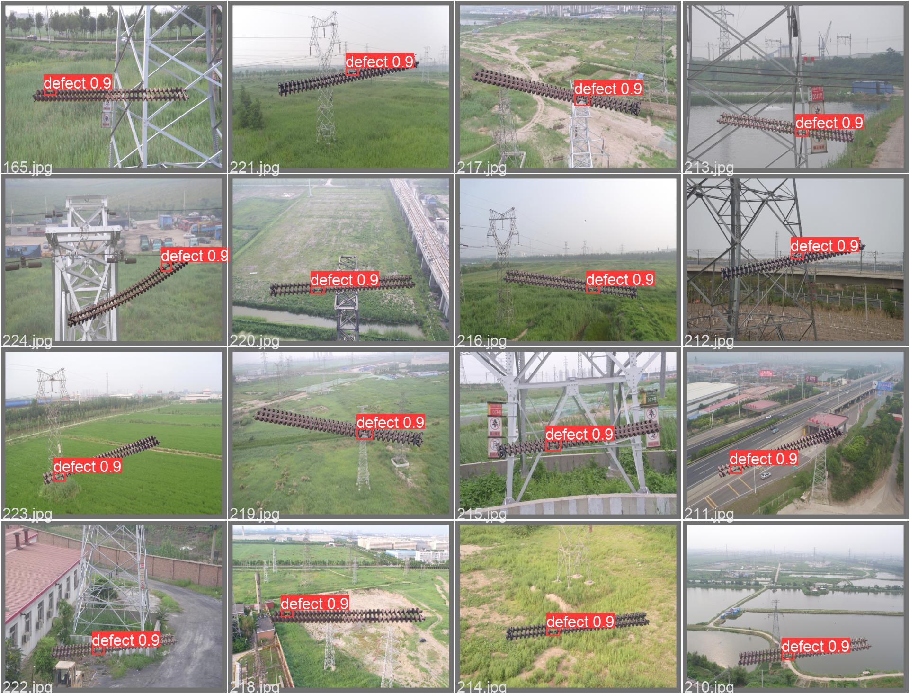

# Insulator Detection with YOLOv5


## Overview

This repository is a cleaned project snapshot for insulator detection based on a YOLOv5-style codebase. It keeps the training, validation, detection, UI, and utility scripts that were actually used in the local project.

## Preview

| Training Curve | Validation Preview |
| --- | --- |
|  |  |

## Highlights

- insulator-detection training and inference pipeline
- PyQt-based demo interface
- preserved training curves and validation previews
- extra project-specific data utilities under `custom_tools/`

## Project Structure

- `detect.py`: inference / detection logic
- `train.py`: training script
- `val.py`: validation script
- `ui.py`: PyQt-based demo interface
- `cfg/`, `models/`, `utils/`: model configs and YOLO support code
- `custom_tools/`: project-specific helper scripts
- `figures/`: exported result images
- `notes/detect_commented.py`: commented learning copy of the detection script

## Setup

```bash
pip install -r requirements.txt
```

If you want to run the UI:

```bash
pip install PyQt5
```

## Usage

Run detection:

```bash
python detect.py --weights path/to/best.pt --source path/to/image_or_video
```

Run training:

```bash
python train.py --data your_dataset.yaml --cfg cfg/training/yolov7.yaml --weights ''
```

## Notes

- Large weights, runtime videos, and environment tutorial files are not included in this cleaned version.
- To reproduce training or inference, you need to provide your own dataset and checkpoints locally.
